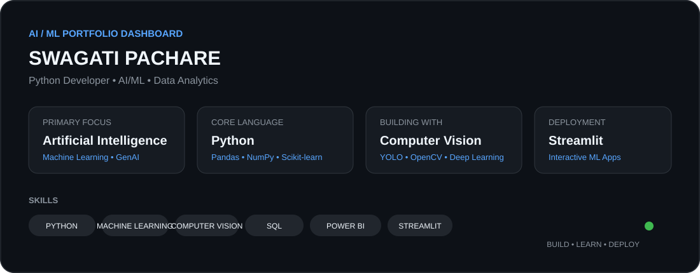

<div align="center">



<br/>

<a href="https://github.com/swagatipachare">

</a>
<a href="https://www.linkedin.com/">

</a>

</div>

---

## ⚡ About Me

I'm an **AI/ML and Data enthusiast** focused on building practical, data-driven applications with Python.

My workflow:

**Data → Clean → Explore → Model → Evaluate → Visualize → Deploy**

- 🤖 Artificial Intelligence & Machine Learning
- 🐍 Python development
- 👁️ Computer Vision & Deep Learning
- 📊 Data Analytics & Visualization
- 🧠 Generative AI
- 🚀 Streamlit-based ML applications

---

## 🧩 Tech Stack

| Area | Technologies |
|---|---|
| **Programming** | Python, SQL |
| **Data** | Pandas, NumPy |
| **Machine Learning** | Scikit-learn, TensorFlow |
| **Computer Vision** | OpenCV, YOLO |
| **Visualization** | Matplotlib, Seaborn, Power BI, Tableau |
| **Deployment** | Streamlit |
| **Tools** | Git, GitHub, Jupyter, VS Code |

---

# 🚀 Featured Work

### 📜 Sanskrit Manuscript Classification
Computer-vision project focused on multi-class manuscript image detection/classification.

**Python • YOLO • Computer Vision**

### 👁️ Computer Vision Projects
Image detection and classification workflows using modern computer-vision techniques.

**Python • OpenCV • YOLO**

### 📊 Machine Learning Projects
End-to-end predictive modeling including preprocessing, EDA, training, evaluation and deployment.

**Python • Pandas • NumPy • Scikit-learn**

### 📈 Data Analytics
Data cleaning, exploratory analysis, visualization and dashboard-oriented projects.

**Python • SQL • Power BI • Tableau**

---

## 📊 GitHub Activity

> GitHub's contribution graph below is live and maintained by GitHub itself.

<div align="center">


</div>

---

## 🐍 Contribution Snake

<div align="center">


</div>

---

## 🌱 Currently Exploring

```text
Generative AI
     │
     ├── Large Language Models
     │
     ├── AI Applications
     │
     ├── Advanced Machine Learning
     │
     └── Computer Vision
```

---

## 🎯 Career Focus

I'm interested in opportunities involving:

**AI/ML · Python · Data Analytics · Computer Vision · Generative AI**

I enjoy solving real-world problems, learning new technologies, and turning ideas into working applications.

---

## 🤝 Let's Connect

<div align="center">

<a href="https://github.com/swagatipachare">

</a>

<a href="https://www.linkedin.com/">

</a>

<br/><br/>

### ⭐ Thanks for visiting!

**Build • Learn • Deploy • Repeat 🚀**

</div>
