<div align="center">



<br/>


<br/><br/>

<a href="https://github.com/swagatipachare">

</a>
<a href="https://www.linkedin.com/in/swagati-pachare-9ba673331">

</a>
<a href="mailto:swagatipachare123@gmail.com">

</a>

<br/><br/>


</div>

---

## ⚡ About me

<div align="center">

I'm an **AI/ML and Data enthusiast** focused on building practical, data-driven applications with Python.

**My workflow**

`Data` → `Clean` → `Explore` → `Model` → `Evaluate` → `Visualize` → `Deploy`

<br/>


</div>

<br/>

## 🧩 Tech stack

**Programming & Data**


**Machine learning & computer vision**


**Visualization & BI**


**Deployment & tools**


<br/>

---

## 🚀 Featured work

<table>
<tr>
<td width="50%" valign="top">

### 📜 Sanskrit manuscript classification
Computer-vision project focused on multi-class manuscript image detection and classification.

`Python` `YOLO` `Computer Vision`

</td>
<td width="50%" valign="top">

### 🕳️ Pothole detection system
Drone-based pothole detection with YOLOv8, a Flask and MySQL backend, and live map sync using Leaflet.

`YOLOv8` `Flask` `MySQL` `Leaflet`

</td>
</tr>
<tr>
<td width="50%" valign="top">

### 🔣 Symbol2Text
AI-powered symbol detection and translation system that converts detected symbols into readable text.

`Python` `Deep Learning` `Computer Vision`

</td>
<td width="50%" valign="top">

### 📈 Data analytics & dashboards
Data cleaning, exploratory analysis, visualization, and dashboard-oriented projects.

`Python` `SQL` `Power BI` `Tableau`

</td>
</tr>
<tr>
<td colspan="2" valign="top">

### 📊 Machine learning projects
End-to-end predictive modeling — preprocessing, EDA, training, evaluation, and deployment.

`Python` `Pandas` `NumPy` `Scikit-learn`

</td>
</tr>
</table>

<br/>

---

## 📊 GitHub analytics

<div align="center">


<br/><br/>


<br/><br/>


</div>

<br/>

## 🐍 Contribution snake

<div align="center">


</div>

<br/>

## 🌱 Currently exploring

```text
Generative AI
     │
     ├── Large Language Models
     ├── AI Applications
     ├── Advanced Machine Learning
     └── Computer Vision
```

<br/>

## 🎯 Career focus

I'm interested in opportunities involving:

<div align="center">


</div>

I enjoy solving real-world problems, learning new technologies, and turning ideas into working applications.

<br/>

## 🤝 Let's connect

<div align="center">

<a href="https://github.com/swagatipachare">

</a>
<a href="https://www.linkedin.com/in/swagati-pachare-9ba673331">

</a>

<br/><br/>

### ⭐ Thanks for visiting!

**Build • Learn • Deploy • Repeat 🚀**


</div>
